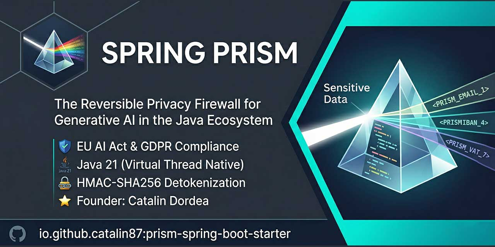
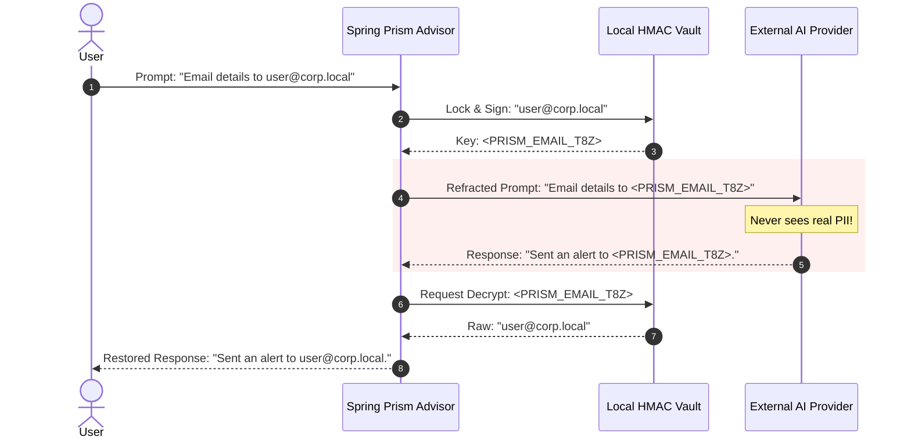

# 🌈 Spring Prism

> **The Reversible Privacy Firewall for Generative AI in the Java Ecosystem.**
> [📖 Read the Documentation](https://catalin87.github.io/spring-prism/)

Spring Prism is a rigorous, zero-dependency data privacy framework designed for integration with
**Spring AI**, **LangChain4j**, and **MCP client flows**. It seamlessly sits between your robust
backend infrastructure and untrusted Large Language Model providers or tool endpoints, ensuring
sensitive data mathematically *cannot* escape your enterprise boundaries.

---

## 🏛️ The "Why": EU AI Act & GDPR Sovereignty
In the era of Generative AI, passing raw user prompts to external APIs frequently violates **Data Sovereignty**, the **GDPR**, and the upcoming **EU AI Act**. 

Spring Prism actualizes **"Privacy by Design"** by establishing a zero-trust perimeter around your generative workflows. Before an LLM request crosses the network edge, Prism **refracts** sensitive Personally Identifiable Information (PII) into reversible, cryptographically signed tokens (e.g., `<PRISM_EMAIL_uM9bA>`). When the LLM responds utilizing that token, Prism **restores** the original data dynamically—tricking the AI into safely reasoning about entities it technically cannot see.

## 🔄 The Refraction Flow



## ⚡ Core Properties

* **🌱 Java 21 Baseline:** Built and validated on Java 21 with Spring Boot 3.4.x.
* **🛡️ Zero Spring or AI Dependencies in Core:** `prism-core` stays decoupled from Spring, Spring AI, and LangChain4j so the detection and vault engine remains portable.
* **🇪🇺 EU-First Detectors:** Ships with universal detectors plus European standards such as **IBAN** (Pan-EU), **PESEL** (PL), **CNP** (RO), and **EU VAT**.
* **🌊 Streaming Resilient:** `StreamingBuffer` restores tokens correctly even when model responses split them across multiple chunks.
* **📏 Measured Performance:** The repo now includes a `prism-benchmarks` JMH module plus runtime timing metrics for scan, tokenize, and detokenize paths.

---

## 🚀 Quick Start Snippet

Use the starter-first path in your Spring Boot app:

```java
@Configuration
public class AiConfiguration {

    @Bean
    ChatClient protectedChatClient(ChatClient.Builder builder) {
        return builder.build();
    }
}
```

```yaml
spring:
  prism:
    enabled: true
    app-secret: change-me
    vault:
      type: auto
    locales: UNIVERSAL
```

For manual wiring, advanced rule-pack selection, and both integration paths, start with the
example apps under `prism-examples/` and the docs in `website/docs/`.

For deployment topology:

- `spring.prism.vault.type=in-memory` is appropriate for single-node deployments
- `spring.prism.vault.type=redis` is the recommended path for multi-node or Kubernetes deployments
- `spring.prism.vault.type=auto` preserves starter ergonomics and automatically uses Redis when a
  `StringRedisTemplate` bean is already present

Example multi-node Redis setup:

```yaml
spring:
  data:
    redis:
      host: redis.internal
      port: 6379
  prism:
    app-secret: ${PRISM_APP_SECRET}
    vault:
      type: redis
    ttl: 30m
```

## ✅ Compatibility

| Surface | Version |
| --- | --- |
| Java | `21` |
| Spring Boot | `3.4.x` |
| Spring AI | `1.0.0-M5` |
| LangChain4j | `1.0.1` |

## 🧪 Runnable Examples

Spring Prism now ships with three minimal sample apps under `prism-examples/`:

- `spring-ai-example`: starter + Spring AI `ChatClient`
- `langchain4j-example`: starter + LangChain4j `ChatModel`
- `mcp-example`: starter + MCP stdio client protection with a fake local server

Each example boots with Java 21, avoids real API keys, and includes an integration test proving
that the delegate sees tokenized content while the caller receives restored PII.

## 🔁 Upgrade Notes

Use the starter-first path as the default integration model and see `website/docs/migration-guide.md`
for the current Spring AI constructor shape, LangChain4j wrapper behavior, and explicit vault
selection defaults.

## 📦 Release Readiness

The current supported library surface is:

- `prism-core`
- `prism-spring-ai`
- `prism-langchain4j`
- `prism-mcp`
- `prism-spring-boot-starter`
- `prism-dashboard`
- `prism-examples`

Deferred surfaces:

- MCP server-side interception

Optional release-train surfaces:

- `prism-extensions-nlp` for opt-in person-name detection with heuristic or hybrid OpenNLP scoring

See `website/docs/release-readiness.md` for the current verification baseline, release-profile
expectations, and the shipped-vs-deferred support boundary.

For operational dashboards outside the embedded UI, see `website/docs/grafana.md` for the current
Grafana integration approach based on the Prism runtime snapshot.

For optional person-name redaction outside the deterministic core detector set, see
`website/docs/nlp-extensions.md`.

For production rollout guidance in clustered environments, see:

- `website/docs/distributed-deployments.md`
- `website/docs/troubleshooting.md`

The current `main` branch also passes:

```bash
mvn clean verify
```

and the performance benchmark module can be packaged with:

```bash
mvn -pl prism-benchmarks -am package -DskipTests
```

---

## 🔒 Security Posture & Architecture Guarantee

> [!IMPORTANT]
> **Availability Over Interruption (Fail-Open Default)**
> If a PII detector encounters a catastrophic parsing anomaly or unexpected string condition, Spring Prism emits a Micrometer warning and **Fails Open** (allowing the text through) rather than crashing the Virtual Thread processing your LLM payload.

- **Non-Reversible Cryptography:** Token payloads aren't mere counters or UUIDs; they are statically hardened with **HMAC-SHA256** signatures. This means the LLM (or an orchestrator) cannot trick the firewall into decrypting adjacent user variables without holding the exact contextual signature.

## 🧩 Module Map

Spring Prism executes strict isolation through a robust Maven multi-module architecture:

| Maven Module | Architectural Role |
| -------------- | ------- |
| `prism-core` | The zero-dependency cryptographic Vault, generic `PiiDetector` interfaces, and string boundaries. |
| `prism-spring-ai` | Spring AI advisor integration for synchronous and streaming chat interception. |
| `prism-langchain4j` | LangChain4j `ChatModel` and `StreamingChatModel` decorators for tokenization and restoration. |
| `prism-mcp` | MCP client-side protection for stdio and Streamable HTTP transports with structured payload walking. |
| `prism-spring-boot-starter` | Boot auto-configuration, properties, metrics, custom rules, and Redis-backed vault selection. |
| `prism-benchmarks` | JMH benchmarks for detector scanning, vault operations, streaming restoration, and Redis-vault overhead. |
| `prism-examples` | Runnable Spring Boot examples for Spring AI, LangChain4j, and MCP client flows. |
| `prism-dashboard` | Embedded observability dashboard with retained history, exports, alerts, and operator filters. |

---

## 📜 Governance & Strategic Licensing

Spring Prism is built for the long-term stability of the Java ecosystem. To ensure both community growth and enterprise-grade reliability, the project operates under a **Strategic Dual Licensing** model. See [LICENSE.md](./LICENSE.md) for details.

### 1. Open Source (EUPL 1.2)
For open-source enthusiasts, students, and non-profit projects, Spring Prism is available under the **European Union Public Licence (EUPL) v1.2**. 
* **Copyleft:** Services provided over a network (SaaS) or derivative works must remain open-source under a compatible license.
* **Compliance:** The EUPL is the official license of the European Commission, perfectly aligned with the **GDPR** and **EU AI Act** terminology.

### 2. Commercial Enterprise License
For banks, financial institutions, and corporate environments that cannot accept copyleft restrictions or require internal proprietary integration, we offer a **Commercial License**.
* **Benefits:** Exemption from EUPL copyleft clauses, dedicated SLA, priority support, and access to premium/custom PII Rule Packs.
* **Contact:** To discuss enterprise licensing or custom implementations, contact **catalin87@gmail.com**.

### 🤝 Contributing & CLA
We welcome contributions! To maintain the project's legal integrity and support our dual-licensing model, all contributors must sign our automated **Contributor License Agreement (CLA)**. 
* When you open your first Pull Request, our bot will guide you through the 3-second "Click-to-Sign" process.
* For details on how to get involved, see [CONTRIBUTING.md](./CONTRIBUTING.md).

### 🏛️ Project Governance
Decisions regarding the core architecture, security standards, and the roadmap are managed under a transparent governance model led by the founder, **Catalin Dordea**. For more information on roles and decision-making, see [GOVERNANCE.md](./GOVERNANCE.md).

## ⚠️ Disclaimer & Limitation of Liability

**Spring Prism is provided on an "AS IS" basis, without warranties or conditions of any kind.**

While Spring Prism utilizes high-precision detection rules (Regex, Heuristics, and Locales), **no automated PII detection system is 100% foolproof.** Language is inherently ambiguous, and new patterns of data exposure emerge constantly.

- **Accuracy:** The Project Lead and contributors do not guarantee that all sensitive data will be detected and redacted in every scenario. 
- **User Responsibility:** Users are solely responsible for auditing their specific PII detection requirements and ensuring that the configured `PrismRulePack` meets their compliance standards (GDPR, HIPAA, EU AI Act, etc.).
- **Limitation of Liability:** Under no circumstances shall the author(s) or the Project be liable for any direct, indirect, incidental, or consequential damages resulting from the use of, or inability to use, this software, including but not limited to data leaks or regulatory fines.

**Always perform a thorough security audit of your Generative AI workflows before moving to production.**

---

*Notice of Non-Affiliation: Spring Prism is an independent privacy firewall and is not affiliated, sponsored, or endorsed by VMware, Broadcom, or the Spring Framework.*
