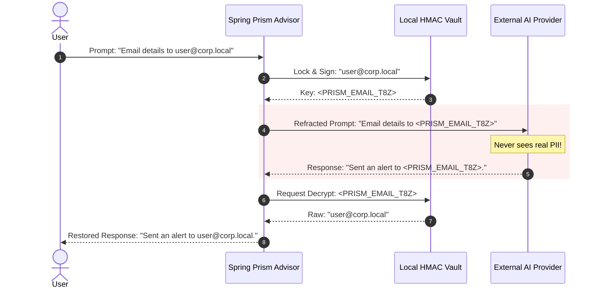

# 🌈 Spring Prism

> **The Reversible Privacy Firewall for Generative AI in the Java Ecosystem.**
> [📖 Read the Documentation](https://catalin87.github.io/spring-prism/)

Spring Prism is a rigorous, zero-dependency data privacy framework designed for integration with **Spring AI** and **LangChain4j**. It seamlessly sits between your robust backend infrastructure and untrusted Large Language Model providers (OpenAI, Anthropic, Mistral), ensuring sensitive data mathematically *cannot* escape your enterprise boundaries.

---

## 🏛️ The "Why": EU AI Act & GDPR Sovereignty
In the era of Generative AI, passing raw user prompts to external APIs frequently violates **Data Sovereignty**, the **GDPR**, and the upcoming **EU AI Act**. 

Spring Prism actualizes **"Privacy by Design"** by establishing a zero-trust perimeter around your generative workflows. Before an LLM request crosses the network edge, Prism **refracts** sensitive Personally Identifiable Information (PII) into reversible, cryptographically signed tokens (e.g., `<PRISM_EMAIL_uM9bA>`). When the LLM responds utilizing that token, Prism **restores** the original data dynamically—tricking the AI into safely reasoning about entities it technically cannot see.

## 🔄 The Refraction Flow



## ⚡ Core Properties

*   **🌱 Java 21 Baseline:** Built and validated on Java 21 with Spring Boot 3.4.x.
*   **🛡️ Zero Spring or AI Dependencies in Core:** `prism-core` stays decoupled from Spring, Spring AI, and LangChain4j so the detection and vault engine remains portable.
*   **🇪🇺 EU-First Detectors:** Ships with universal detectors plus European standards such as **IBAN** (Pan-EU), **PESEL** (PL), **CNP** (RO), and **EU VAT**.
*   **🌊 Streaming Resilient:** `StreamingBuffer` restores tokens correctly even when model responses split them across multiple chunks.
*   **📏 Measured Performance:** The repo now includes a `prism-benchmarks` JMH module plus runtime timing metrics for scan, tokenize, and detokenize paths.

---

## 🚀 Quick Start Snippet

Use the starter-first path in your Spring Boot app:

```java
@Configuration
public class AiConfiguration {

    @Bean
    ChatClient protectedChatClient(ChatClient.Builder builder) {
        return builder.build();
    }
}
```

```yaml
spring:
  prism:
    enabled: true
    app-secret: change-me
    locales: UNIVERSAL
```

For manual wiring, advanced rule-pack selection, and both integration paths, start with the
example apps under `prism-examples/` and the docs in `website/docs/`.

## ✅ Compatibility

| Surface | Version |
| --- | --- |
| Java | `21` |
| Spring Boot | `3.4.x` |
| Spring AI | `1.0.0-M5` |
| LangChain4j | `1.0.1` |

## 🧪 Runnable Examples

Spring Prism now ships with two minimal sample apps under `prism-examples/`:

- `spring-ai-example`: starter + Spring AI `ChatClient`
- `langchain4j-example`: starter + LangChain4j `ChatModel`

Each example boots with Java 21, avoids real API keys, and includes an integration test proving
that the delegate sees tokenized content while the caller receives restored PII.

## 🔁 Upgrade Notes

Use the starter-first path as the default integration model and see `website/docs/migration-guide.md`
for the current Spring AI constructor shape, LangChain4j wrapper behavior, and Redis auto-selection
defaults.

## 📦 Release Readiness

The current supported library surface is:

- `prism-core`
- `prism-spring-ai`
- `prism-langchain4j`
- `prism-spring-boot-starter`
- `prism-examples`

Deferred surfaces:

- `prism-dashboard`
- MCP support

See `website/docs/release-readiness.md` for the current verification baseline, release-profile
expectations, and the shipped-vs-deferred support boundary.

The current `main` branch also passes:

```bash
mvn clean verify
```

and the performance benchmark module can be packaged with:

```bash
mvn -pl prism-benchmarks -am package -DskipTests
```

---

## 🔒 Security Posture & Architecture Guarantee

> [!IMPORTANT]
> **Availability Over Interruption (Fail-Open Default)**
> If a PII detector encounters a catastrophic parsing anomaly or unexpected string condition, Spring Prism emits a Micrometer warning and **Fails Open** (allowing the text through) rather than crashing the Virtual Thread processing your LLM payload.

- **Non-Reversible Cryptography:** Token payloads aren't mere counters or UUIDs; they are statically hardened with **HMAC-SHA256** signatures. This means the LLM (or an orchestrator) cannot trick the firewall into decrypting adjacent user variables without holding the exact contextual signature.

## 🧩 Module Map

Spring Prism executes strict isolation through a robust Maven multi-module architecture:

| Maven Module | Architectural Role |
| -------------- | ------- |
| `prism-core` | The zero-dependency cryptographic Vault, generic `PiiDetector` interfaces, and string boundaries. |
| `prism-spring-ai` | Spring AI advisor integration for synchronous and streaming chat interception. |
| `prism-langchain4j` | LangChain4j `ChatModel` and `StreamingChatModel` decorators for tokenization and restoration. |
| `prism-spring-boot-starter` | Boot auto-configuration, properties, metrics, custom rules, and Redis-backed vault selection. |
| `prism-benchmarks` | JMH benchmarks for detector scanning, vault operations, streaming restoration, and Redis-vault overhead. |
| `prism-examples` | Runnable Spring Boot examples for the Spring AI and LangChain4j integration paths. |
| `prism-dashboard` | Deferred optional dashboard module for future observability UX work. |

## 📜 Governance & Licensing

Spring Prism is rigorously protected under the **EUPL 1.2 (European Union Public Licence)**. The original author (Catalin Dordea) maintains explicit sovereign control over core project mergers to perpetually guarantee full GDPR and EU AI Act algorithmic alignment.

*Notice of Non-Affiliation: Spring Prism is an independent privacy firewall and is not affiliated, sponsored, or endorsed by VMware, Broadcom, or the Spring Framework.*
