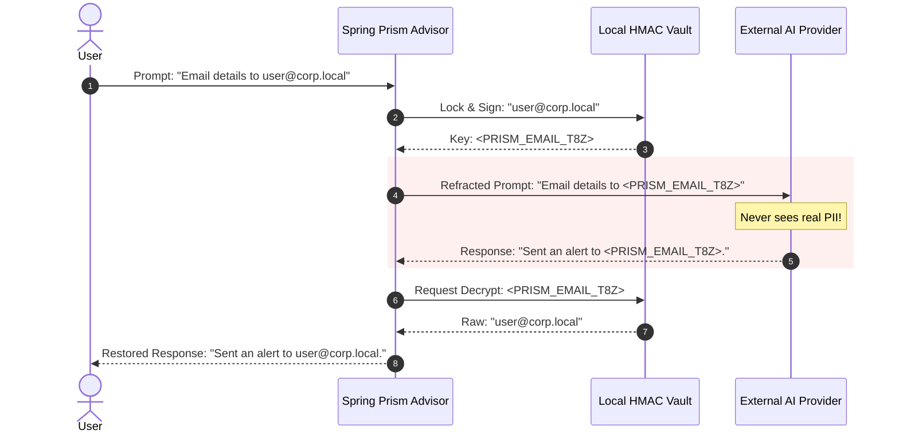

# 🌈 Spring Prism

> **The Reversible Privacy Firewall for Generative AI in the Java Ecosystem.**

Spring Prism is a rigorous, zero-dependency data privacy framework designed specifically for integration with **Spring AI** and **LangChain4j**. It seamlessly sits between your robust backend infrastructure and untrusted Large Language Model providers (OpenAI, Anthropic, Mistral), ensuring sensitive data mathematically *cannot* escape your enterprise boundaries.

---

## 🏛️ The "Why": EU AI Act & GDPR Sovereignty
In the era of Generative AI, passing raw user prompts to external APIs frequently violates **Data Sovereignty**, the **GDPR**, and the upcoming **EU AI Act**. 

Spring Prism actualizes **"Privacy by Design"** by establishing a zero-trust perimeter around your generative workflows. Before an LLM request crosses the network edge, Prism **refracts** sensitive Personally Identifiable Information (PII) into reversible, cryptographically signed tokens (e.g., `<PRISM_EMAIL_uM9bA>`). When the LLM responds utilizing that token, Prism **restores** the original data dynamically—tricking the AI into safely reasoning about entities it technically cannot see.

## 🔄 The Refraction Flow



## ⚡ Core Properties

*   **🌱 Java 21 Native:** Architected exclusively for high-throughput Virtual Threads (Project Loom) exploiting strictly non-blocking cryptography.
*   **🛡️ Zero-Dependency Core:** `prism-core` contains absolute zero 3rd-party dependencies. No massive vulnerability exposure. Just mathematically pure Java.
*   **🇪🇺 EU-First Detectors:** Ships out of the box with `PrismRulePacks` handling European standards natively: **IBAN** (Pan-EU), **PESEL** (PL), **CNP** (RO), **EU VAT**, alongside universal concepts.
*   **🌊 Streaming Resilient:** The `StreamingBuffer` mathematically unifies split LLM chunk payloads, guaranteeing perfectly accurate Restoration even if a token arrives fragmented across multiple server-sent events.

---

## 🚀 Quick Start Snippet

Inject Spring Prism completely invisibly onto your `ChatClient` using our non-invasive architectural interceptors:

```java
@Configuration
public class AiConfiguration {

    @Bean
    public ChatClient protectedChatClient(
            ChatClient.Builder builder, 
            PrismRulePack europeRulePack, 
            PrismVault memoryVault) {
            
        // Refract the data transparently into the Vault, and Restore seamlessly on return!
        return builder
            .defaultAdvisors(new PrismChatClientAdvisor(memoryVault, europeRulePack))
            .build();
    }
}
```

---

## 🔒 Security Posture & Architecture Guarantee

> [!IMPORTANT]
> **Availability Over Interruption (Fail-Open Default)**
> If a PII detector encounters a catastrophic parsing anomaly or unexpected string condition, Spring Prism emits a Micrometer warning and **Fails Open** (allowing the text through) rather than crashing the Virtual Thread processing your LLM payload.

- **Non-Reversible Cryptography:** Token payloads aren't mere counters or UUIDs; they are statically hardened with **HMAC-SHA256** signatures. This means the LLM (or an orchestrator) cannot trick the firewall into decrypting adjacent user variables without holding the exact contextual signature.

## 🧩 Module Map

Spring Prism executes strict isolation through a robust Maven multi-module architecture:

| Maven Module | Architectural Role |
| -------------- | ------- |
| `prism-core` | The zero-dependency cryptographic Vault, generic `PiiDetector` interfaces, and string boundaries. |
| `prism-spring-boot-starter` | Instantly initializes Spring AI auto-configurations and exposes cleanly configurable `application.yml` localization boundaries. |
| `prism-dashboard` | An optional, self-hosted visual interface rendering Micrometer usage statistics on exactly what PII parameters were prevented from escaping to the LLM. |

## 📜 Governance & Licensing

Spring Prism is rigorously protected under the **EUPL 1.2 (European Union Public Licence)**. The original author (Catalin Dordea) maintains explicit sovereign control over core project mergers to perpetually guarantee full GDPR and EU AI Act algorithmic alignment.

*Notice of Non-Affiliation: Spring Prism is an independent privacy firewall and is not affiliated, sponsored, or endorsed by VMware, Broadcom, or the Spring Framework.*
